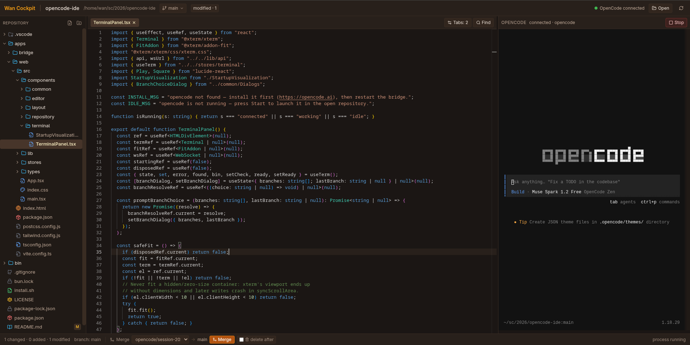

# OpenCode Cockpit v0.1.0

Visual cockpit for [OpenCode](https://opencode.ai) — see what the AI is changing, review diffs, and keep your repo safe without leaving the terminal.



> Three panels: **Files** (left) · **Code / Diff** (center) · **OpenCode Terminal** (right). Filesystem and Git are the source of truth.

---

## Install — Cross-Platform (macOS, Linux, Windows)

### macOS / Linux / Windows (Git Bash):
```sh
curl -fsSL https://raw.githubusercontent.com/wansatya/opencode-ide/main/install.sh | bash
```

### Windows (PowerShell):
```powershell
iwr -useb https://raw.githubusercontent.com/wansatya/opencode-ide/main/install.ps1 | iex
```

This clones to `~/.opencode-ide`, installs dependencies, builds, and links `cockpit` to `~/.local/bin`.

Requires: **Node 20+**, **git**, **opencode** CLI.

---

## Run

```sh
cockpit start ~/projects/my-app        # open that repo, start servers, open browser
cockpit start ~/projects/my-app --prod # production build on http://localhost:3101
cockpit stop | cockpit status | cockpit logs -f
```

Or manually:

```sh
npm run install:all
npm run dev      # web http://localhost:5173 + bridge http://localhost:3101
npm run build && npm start   # production
```

1. Open the UI  
2. Pick a repo (or it opens the one you passed to `cockpit start`)  
3. Click **Start** in the terminal panel to launch `opencode`.

Other commands: `cockpit start . --no-browser` (don't open browser), `cockpit start . --no-branch` (work on current branch directly).

---

## What you can do

**See your repo clearly**
- File tree with icons and Git colors (modified / added / deleted)
- Respects `.gitignore`, handles big repos (truncates at 20k files, use Quick Open for deeper files)
- Resize panels by dragging, hide/show with keyboard

**Edit without fear**
- Monaco editor with tabs, dirty indicator (`•`), Code vs Diff view
- Find & Replace (`Ctrl+F` / `Ctrl+H`) with case / whole-word / regex and `Replace All`
- Save (`Ctrl+S`), indentation (Spaces/Tabs, 2 or 4) saved locally
- Warns before overwriting: if OpenCode changed a file you were editing, you choose `Compare` / `Keep Mine` / `Reload`

**Create & delete from the UI**
- Right-click in the file tree → `New File` / `New Folder` (you can type `a/b/c.txt`) and `Delete` (with confirmation)

**Git — safe by default**
- Top bar shows current branch, click to switch branches
- Footer shows `changed · added · modified` and lets you **merge any branch into the current one in one click** — pick a branch, hit **Merge**, optionally check **delete after** (off by default)
- Diff viewer compares file against `HEAD` so you see exactly what changed

**OpenCode — isolated sessions**
- Terminal is a real PTY (`xterm.js`): colors, cursor, `Ctrl+C`, paste all work
- Each Start creates an isolated `opencode/session-*` branch so `main` is never overwritten directly — merge manually when ready
- If session branches already exist, you get a prompt: `Create new branch` or `Continue last branch`
- Disable isolation with `--no-branch` or `COCKPIT_AUTO_BRANCH=0`

**Stay in sync**
- File watcher updates tree, editor and Git status automatically when OpenCode writes files
- Auto-opens files OpenCode just created and switches to Diff so you spot changes instantly

**Quick navigation**
- `Ctrl+P` — Quick Open any file by name
- `Ctrl+Shift+P` — Command palette (`Open Repository`, `Refresh`, `Focus Terminal`, `Restart OpenCode`…)
- `Ctrl+B` / `Ctrl+Shift+B` — toggle file tree / terminal, ``Ctrl+` `` — focus terminal, `Ctrl+W` — close tab, `Ctrl+Shift+D` — toggle diff

---

## Tips

- **First run:** `cockpit start` kills anything on `:5173`/`:3101`, starts both servers, waits for health, then opens `http://localhost:5173`.
- **Production:** `cockpit start --prod` serves the built `web/dist` from the bridge on `:3101` (builds first if missing).
- **Subfolders:** Opening `~/my-app/src` keeps that folder as your workspace — Git still works via the repo root, but tree/terminal stay where you opened.
- **Not a Git repo?** Everything still works except branch/merge.

---

## Project structure

```
opencode-cockpit/
├── apps/web/      # React + Monaco + xterm UI
├── apps/bridge/   # Node bridge (files, git, watcher, PTY)
├── bin/cockpit    # launcher
├── install.sh     # one-line installer
└── SPEC.md        # full spec
```

`npm run dev` for dev, `npm run build` for prod, `npm test` runs bridge tests. No cloud, no login — all local.

---

## License

MIT — see `LICENSE`.
